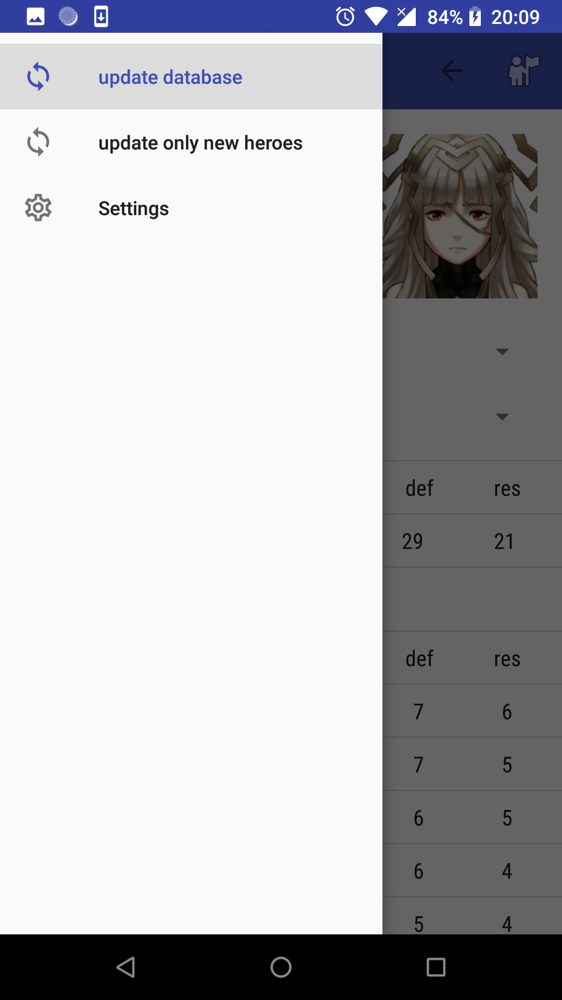
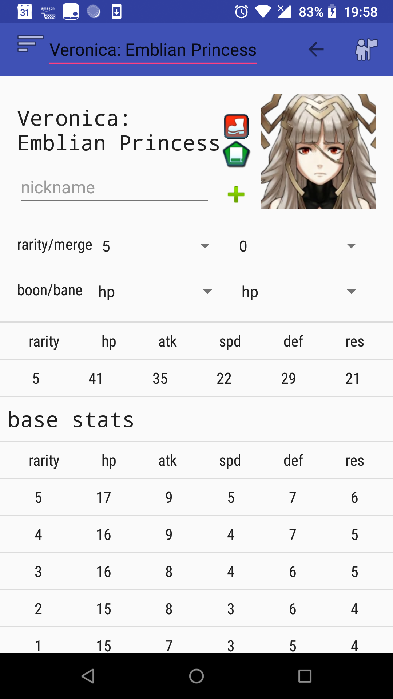

# feh-helper
fire emblem heroes Android helper app, for checking IV. The niche is you don't have to wait for other people to update their database or app when new units comes out, except for gamepedia people, but they're always quick. 

features i want:

- [x] auto update from gamepedia !
- [x] check IV
- [x] save IV
- [x] lookat my heroes
- [x] edit my heroes
- [ ] list all characters
- [ ] sort all characters by stats

minor stuff:

- [x] a way to show +4/-4 stats
- [x] beautify UI (I tried, maybe some other time)
- [ ] update a character on his info page
- [ ] better UI for nickname section
- [ ] some minor but maybe interesting or useful info: map rotation, bst type...

Some screenshots
-
update | edit | check IV | send home
:-:|:-:|:-:|:-:
 |  |  | 
