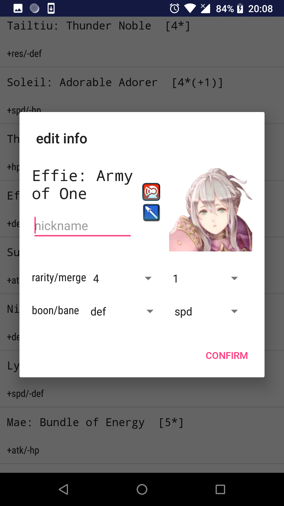

# feh-helper
fire emblem heroes Android helper app in development, for fun i guess, and no need for manual update.

features i want:

- [x] auto update from gamepedia !
- [x] check IV
- [x] save IV
- [x] lookat my heroes
- [x] edit my heroes
- [ ] list all characters
- [ ] sort all characters by stats

minor stuff:

- [x] a way to show +4/-4 stats
- [x] beautify UI (I tried, maybe some other time)
- [ ] better UI for nickname section
- [ ] some minor but maybe interesting or useful info: map rotation, bst type...

Some screenshots
-
{:height="800px" width="450px"} {:height="800px" width="450px"}

{:height="800px" width="450px"} {:height="800px" width="450px"}
